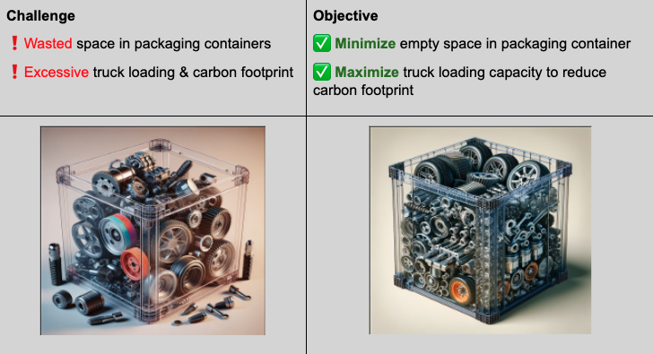
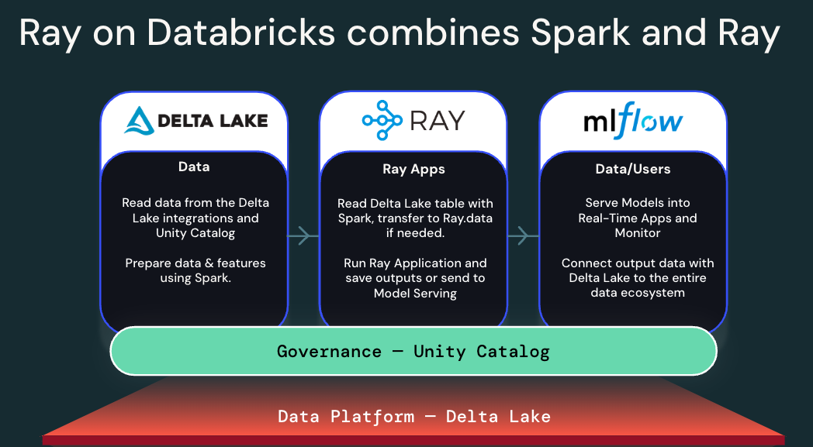
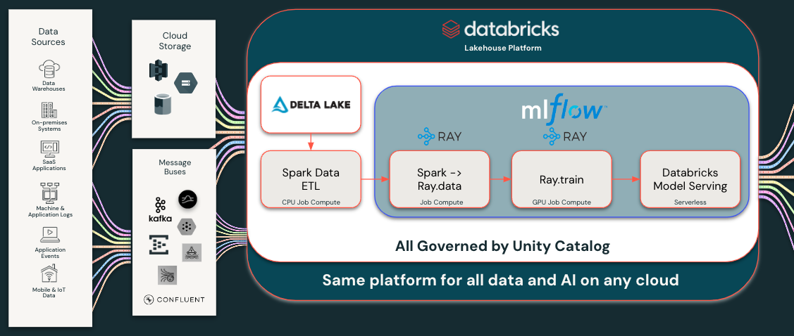

## Business Problem
Many organizations today face a critical challenge in their data science and analytics operations. Data scientists, statisticians, and data developers are often relying on legacy single-node processes to perform complex scientific computing tasks such as optimization, simulation, linear programming, and numerical computing. While these approaches may have been sufficient in the past, they are increasingly inadequate in the face of two major trends:

1. The exponential growth in data volume and complexity that needs to be modeled and analyzed.
2. Heightened business pressure to obtain modeling results and insights faster to enable timely decision-making.

As a result, there is an urgent need for more advanced, scalable techniques that can handle larger datasets and deliver results more quickly. However, transitioning away from established single-node processes presents several challenges:
* Existing code and workflows are often tightly coupled to single-node architectures.
* Data scientists may lack expertise in distributed computing paradigms.
* There are concerns about maintaining reproducibility and consistency when scaling to distributed environments.
* The cost and complexity of setting up and managing distributed infrastructure can be prohibitive.

To address these challenges, this repository demonstrates an expanding set of approaches leveraging the distributed computing framework Ray, implemented on the Databricks data lakehouse platform. The solutions presented aim to:
* Scale single-node processes horizontally with minimal code refactoring, preserving existing workflows where possible.
* Achieve significant improvements in runtime and performance, often by orders of magnitude.
* Enable organizations to make better, more timely business decisions based on the most up-to-date simulation or optimization results.
* Provide a smooth transition path for data scientists to adopt distributed computing practices.
* Leverage the managed infrastructure and integrated tools of the Databricks platform to simplify deployment and management.

By adopting these approaches, organizations can modernize their scientific computing capabilities on Databricks to meet the demands of today's data-intensive business environment. This allows them to unlock new insights, respond more quickly to changing conditions, and gain a competitive edge through advanced analytics at scale.

This repo currently contains examples for the following scientific computing use-cases:

### 1. Bin Packing Optimization

The bin packing problem is a classic optimization challenge that has far-reaching implications for enterprise organizations across industries. At its core, the problem focuses on finding the most efficient way to pack a set of objects into a finite number of containers or "bins", with the goal of minimizing wasted space. 

This challenge is pervasive in real-world applications, from optimizing shipping and logistics to efficiently allocating resources in data centers and cloud computing environments. With organizations often dealing with large numbers of items and containers, finding optimal packing solutions can lead to significant cost savings and operational efficiencies. 

This solution demonstrates how to scale a single-threaded Python library with [Ray Core](https://docs.ray.io/en/latest/ray-core/walkthrough.html) components.

Get started here: [Bin Packing Optimization/01_intro_to_binpacking](Bin_Packing_Optimization/01_intro_to_binpacking)

## Reference Architecture

<!--  -->

## Authors
<tj@databricks.com>

## Project support 

Please note the code in this project is provided for your exploration only, and are not formally supported by Databricks with Service Level Agreements (SLAs). They are provided AS-IS and we do not make any guarantees of any kind. Please do not submit a support ticket relating to any issues arising from the use of these projects. The source in this project is provided subject to the Databricks [License](./LICENSE.md). All included or referenced third party libraries are subject to the licenses set forth below.

Any issues discovered through the use of this project should be filed as GitHub Issues on the Repo. They will be reviewed as time permits, but there are no formal SLAs for support. 

## License

&copy; 2024 Databricks, Inc. All rights reserved. The source in this notebook is provided subject to the Databricks License [https://databricks.com/db-license-source].  All included or referenced third party libraries are subject to the licenses set forth below.

| library                                | description             | license    | source                                              |
|----------------------------------------|-------------------------|------------|-----------------------------------------------------|
|ray|Framework for scaling AI/Python applications|[Apache 2.0](https://github.com/ray-project/ray/blob/master/LICENSE)|[ray-project/ray](https://github.com/ray-project/ray)|
|py3dbp|3D Bin Packing implementation|[MIT](https://github.com/enzoruiz/3dbinpacking/blob/master/LICENSE)|[enzoruiz/3dbinpacking](https://github.com/enzoruiz/3dbinpacking)|
